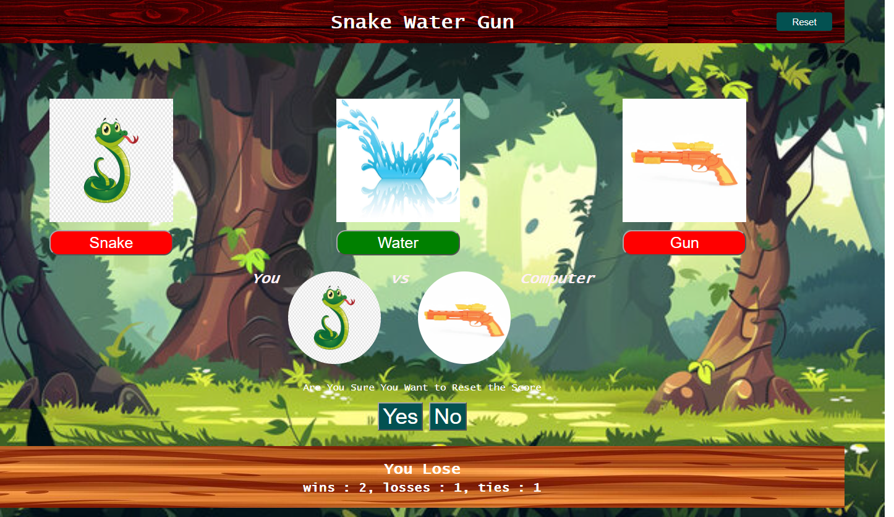

# 🐍💧🔫 Snake Water Gun Game (Multi-Platform)

An interactive implementation of the classic Snake Water Gun game available as both a web application and a CLI terminal tool built in Python.

## 🚀 Live Demo
[👉 Click here to play the Web Version live!](https://priya-bhagat01.github.io/my_SWG_project/)

## 📸 Preview

## 🌿 Repository Branch Structure
This repository utilizes Git branching to maintain different versions of the application:

- **`main`**: Contains the full project repository and documentation.
- **`web-version`**: Production branch containing the HTML, CSS, and JS web implementation deployed to GitHub Pages.
- **`python-version`**: Dedicated branch containing the CLI version designed to run directly in the terminal.

## 🛠️ Key Technical Features
- **Cross-Platform Implementations:** Features a web frontend and a Python command-line utility.
- **Game Logic Engine:** Calculates outcomes based on classic rules:
  - 🐍 **Snake** drinks 💧 **Water** *(Snake Wins)*
  - 💧 **Water** douses 🔫 **Gun** *(Water Wins)*
  - 🔫 **Gun** shoots 🐍 **Snake** *(Gun Wins)*
- **Interactive UI & State Tracking:** Tracks wins, losses, and ties dynamically while handling game resets with confirmation popups.

## 🧰 Tech Stack
- **Web:** HTML5, CSS3, JavaScript (ES6)
- **Terminal:** Python 3
